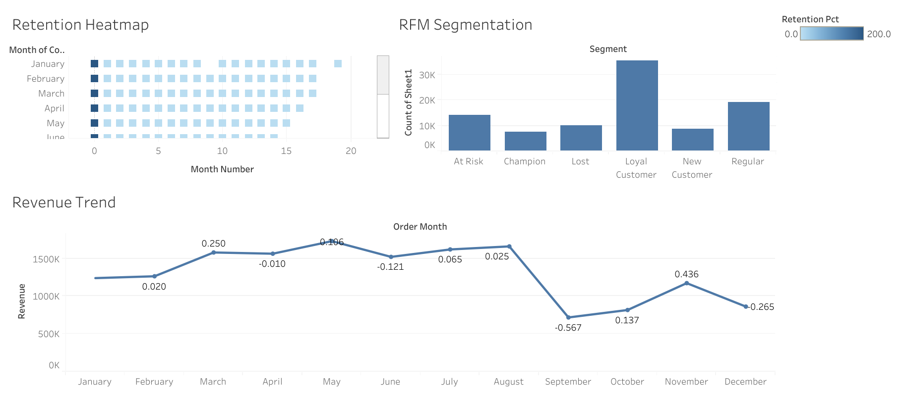
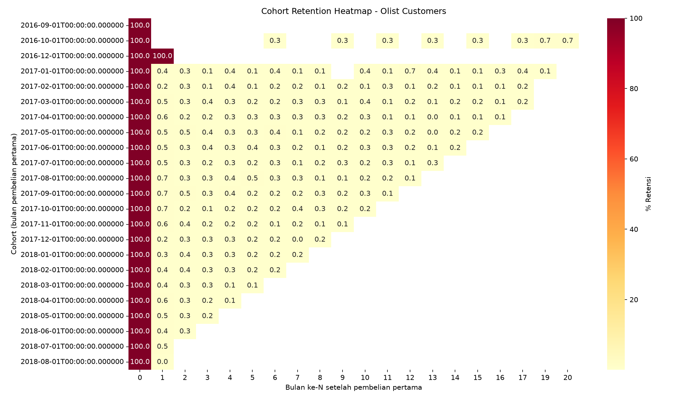

# E-commerce Customer Retention Analysis

> Why is growth slowing down, and which customers are worth keeping?
> An end-to-end SQL and BI analysis of ~100k Brazilian e-commerce orders: revenue trends, cohort retention, and RFM customer segmentation.

**[View the interactive dashboard on Tableau Public](https://public.tableau.com/app/profile/natanael.albert/viz/OlistBrazilianEcommerceDataAnalysis/Dashboard1?publish=yes)**



---

## Business Problem

The management team of an online marketplace noticed that revenue growth was slowing down. They wanted answers to three questions:

1. **When** did growth start to slow, and is it driven by fewer orders or lower order value?
2. **Do customers come back** after their first purchase, and how fast does that retention decay?
3. **Which customer segments** deserve retention budget, and which do not?

## Dataset

[Olist Brazilian E-Commerce Public Dataset](https://www.kaggle.com/datasets/olistbr/brazilian-ecommerce) (Kaggle): 9 relational tables covering orders, order items, customers, products, sellers, payments, reviews, and geolocation, from 2016 to 2018.

| Item | Detail |
|---|---|
| Orders | ~100k |
| Unique customers | ~93k (`customer_unique_id`) |
| Period | ISI_PERIODE_DATA_YANG_DIPAKAI |
| Excluded | Orders with status `canceled` or `unavailable` |

**Data model:** see the entity-relationship diagram in [`reports/erd.png`](reports/erd.png).

> **Important data note:** in this dataset `customer_id` is unique *per order*, not per person. The real customer identity is `customer_unique_id`. All retention and RFM analysis uses `customer_unique_id`; using `customer_id` would make every customer look like a one-time buyer.

## Approach

1. **Data modeling:** loaded the 9 CSV files into DuckDB and mapped relationships between tables.
2. **Revenue analysis:** monthly revenue, cumulative revenue, and month-over-month growth using CTEs and window functions (`LAG`, `SUM() OVER`).
3. **Cohort retention:** grouped customers by first purchase month and tracked the share that purchased again in later months.
4. **RFM segmentation:** scored customers on Recency, Frequency, and Monetary value (`NTILE(5)`) and mapped them to business segments.
5. **Dashboard:** built an interactive dashboard in Tableau Public for non-technical stakeholders.

**Metric definitions**
- **Revenue** = `price + freight_value` per order item, summed per order.
- **Recency** = days between a customer's last order and the latest order date in the dataset.
- **Frequency** = number of distinct orders per customer.
- **Monetary** = total revenue per customer.

<!-- ## Key Findings

> Ganti bagian ini dengan angka asli dari hasil query dan dashboard kamu. Contoh format ada di dalam kurung.

1. **Growth pattern:** ISI_TEMUAN_REVENUE (contoh: "Revenue grew steadily until [month/year], then flattened. The slowdown came from fewer new customers rather than lower order value.")
2. **Retention is very low:** ISI_TEMUAN_RETENSI (contoh: "Only X% of customers purchased again in the month after their first order, and retention stayed under Y% in later months.")
3. **Segments:** ISI_TEMUAN_RFM (contoh: "X% of customers fall into Lost, while only Y% are Champions. The At Risk segment holds Z% of total revenue.")



## Business Recommendations

> Sesuaikan dengan temuan aslimu. Kerangka di bawah bisa dipakai.

1. **Prioritize first-to-second purchase conversion.** Because most customers never return, small improvements here (post-purchase email, second-order voucher) likely have the biggest impact.
2. **Target the At Risk segment first.** They have purchase history and value but have gone quiet, so win-back campaigns are cheaper than acquiring new customers.
3. **Do not spend retention budget on Lost customers.** Reactivation cost is likely higher than the expected return.
4. **Track cohort retention monthly** as a standing KPI instead of relying on total revenue alone. -->

## Limitations

Being explicit about these makes the findings more trustworthy:

- **Low repeat-purchase rate is a property of the data.** Most Olist customers bought only once, so frequency is heavily concentrated at 1. Segments based on frequency should be read with care.
- **Tied frequency values and `NTILE`:** `NTILE(5)` splits ties across buckets arbitrarily, so the F score is a weak signal for customers who all have the same frequency. A rule-based F score (for example 1, 2, 3+ orders) would be more robust.
- **Later cohorts are incomplete.** Recent cohorts have had less time to return, so their retention appears lower than it will eventually be.
- **Historical, observational data.** The analysis describes what happened; it does not prove which actions would cause customers to return.

## Repository Structure

```
ecommerce-customer-retention-analysis/
├── data/
│   ├── raw/              # Original Kaggle CSVs (not tracked by git)
│   └── processed/        # Query outputs used by the dashboard
├── notebooks/
│   ├── 00_setup_database.ipynb
│   └── 01_sql_analysis.ipynb
├── sql/
│   ├── 01_monthly_revenue.sql
│   ├── 02_cohort_retention.sql
│   └── 03_rfm_segmentation.sql
├── reports/              # ERD, heatmap, dashboard screenshots
├── requirements.txt
└── README.md
```

## Tech Stack

Python (pandas, DuckDB, seaborn, matplotlib) · SQL (CTEs, window functions, cohort analysis) · Tableau Public

## How to Reproduce

```bash
# 1. Clone and enter the repo
git clone https://github.com/NatanaelAlbert22/ecommerce-customer-retention-analysis.git
cd ecommerce-customer-retention-analysis

# 2. Create environment and install dependencies
python -m venv .venv
.venv\Scripts\activate          # Windows
# source .venv/bin/activate     # Mac/Linux
pip install -r requirements.txt

# 3. Download the dataset from Kaggle into data/raw/
#    https://www.kaggle.com/datasets/olistbr/brazilian-ecommerce
```

4. Run `notebooks/00_setup_database.ipynb` to build the local DuckDB database.
5. Run `notebooks/01_sql_analysis.ipynb` to produce the analysis tables and export them to `data/processed/`.

The `.duckdb` database file is not committed; it is regenerated from the raw CSVs in step 4.

## Author

**NATANAEL ALBERT** · [LinkedIn](ISI_LINK_LINKEDIN) · [GitHub](https://github.com/NatanaelAlbert22)